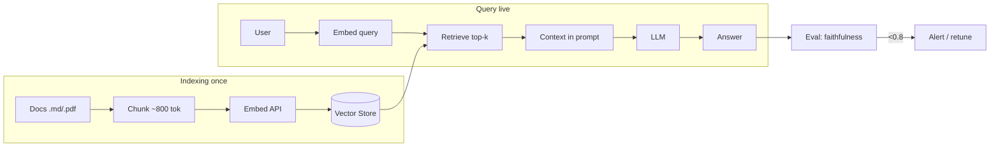

# ai-rag-template

> **Engineering report** — a Retrieval-Augmented Generation (RAG) service that answers
> questions strictly from your own documents, with a built-in evaluation gate.
> Part of the AI Engineering learning track by Nick Yakim.

## 1. Problem & goal
LLMs hallucinate when they lack context. This service grounds every answer in
retrieved documents, so responses stay factual. The goal: a small, production-shaped
RAG that proves the full pattern — ingest → index → retrieve → generate → evaluate.

## 2. Architecture



```
        ┌────────────┐     ┌──────────────┐     ┌──────────────┐
 user ──▶│  FastAPI  │────▶│ Vector Store │◀────│  Ingestion   │
         │  /ask     │     │  (Chroma)    │     │  chunk+embed │
         └────┬──────┘     └──────┬───────┘     └──────────────┘
              │                   │ top-k contexts
              │                   ▼
              │            ┌──────────────┐
              └───────────▶│     LLM      │──▶ answer + eval gate
                           └──────────────┘
```

## 3. Components
- `app.py` — FastAPI service, `/ask` (POST) and `/health`.
- `rag.py` — builds the LlamaIndex query engine from `data/`.
- `eval.py` — RAGAS-style faithfulness gate; **CI fails if faithfulness < 0.8**.
- `data/` — drop your `.md`/`.pdf` here to index.
- `tests/` — smoke test for the app.

## 4. Run
```bash
python -m venv .venv && source .venv/bin/activate
pip install -r requirements.txt
uvicorn app:app --port 8000
curl -X POST localhost:8000/ask -H 'Content-Type: application/json' \
  -d '{"question":"how do I create a VPC?"}'
```

## 5. Evaluation & CI
`python eval.py` computes faithfulness; the GitHub Actions pipeline
(`.github/workflows/ci.yml`, least-privilege + pinned actions) blocks merges
that drop below threshold. This is what separates a demo from an engineering
artifact.

## 6. Docker
```bash
docker build -t rag-app . && docker run -p 8000:8000 rag-app
```

## Author
Nick Yakim — [github.com/yakim-nick](https://github.com/yakim-nick)
